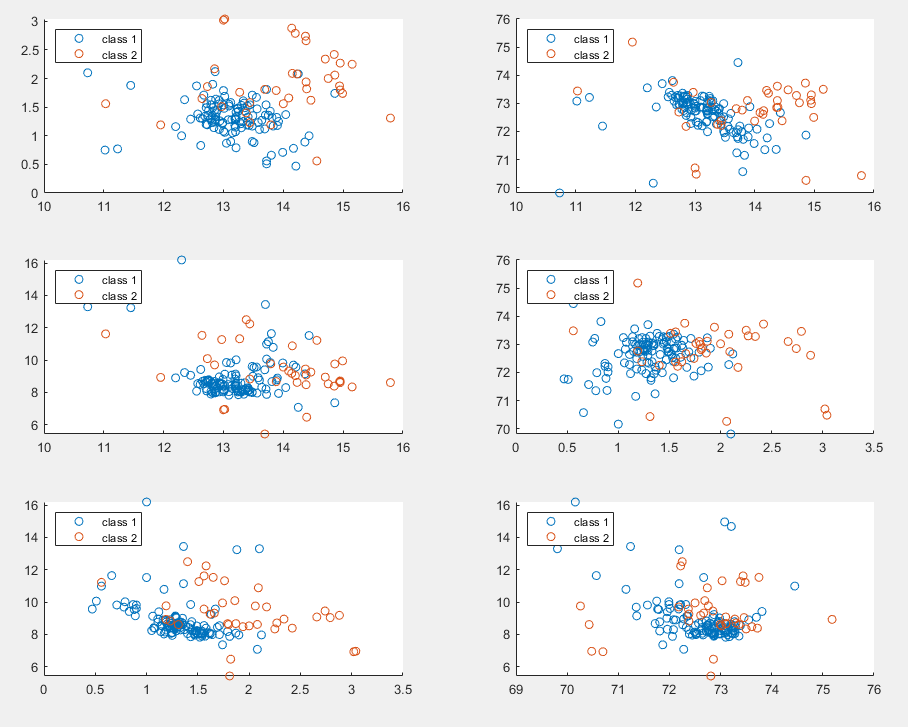

# Density Estimation with Normal Distribution

Suppose you have N i.i.d. observations of a variable x with dimension D, each one with a class associated. Looking at the data, each class looks like to have a multidimensional normal distribution.

The Gaussian distribution defined over a $D$-dimensional vector $x$ of continuous variables is given by

$$\mathcal{N}(x|\mu, \Sigma) = \dfrac{1}{(2\pi)^{\frac{D}{2}}}\dfrac{1}{|\Sigma|^{\frac{1}{2}}}exp\Bigl\{ -\dfrac{1}{2}(x-\mu)^T\Sigma^{-1}(x-\mu) \Bigr\}$$

where the $D$-dimensional vector $\mu$ is called the mean, the $D × D$ matrix $\Sigma$ is called
the covariance, and $|\Sigma|$ denotes the determinant of $\Sigma$.

The parameter values that maximize the likelihood function are the sample mean and the sample variance.

The data we will use has four dimensions. Lets visualize each pair of features plotted:

Calculating parameters for each class c, given a point x, now we can use Bayes to obtain:

$$ p(c|x) \propto p(x|c)p(c) $$

To minimize the probability of misclassification of x, we will choose c having the largest value, because this value is associated to the largest posterior probability. 
