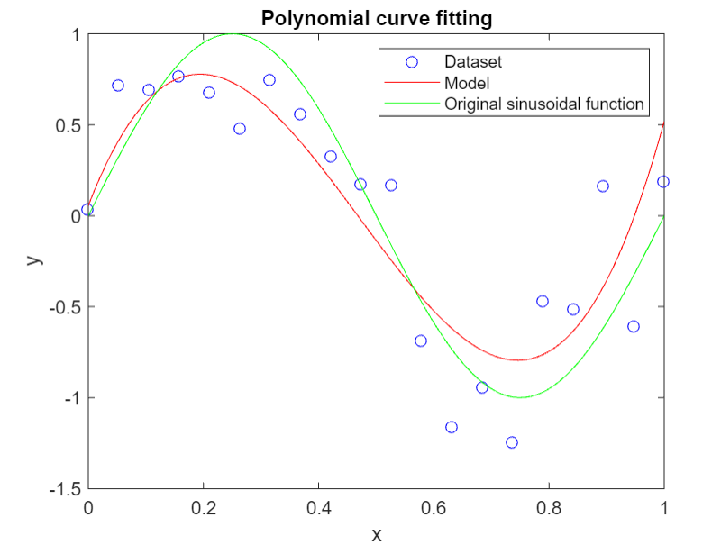
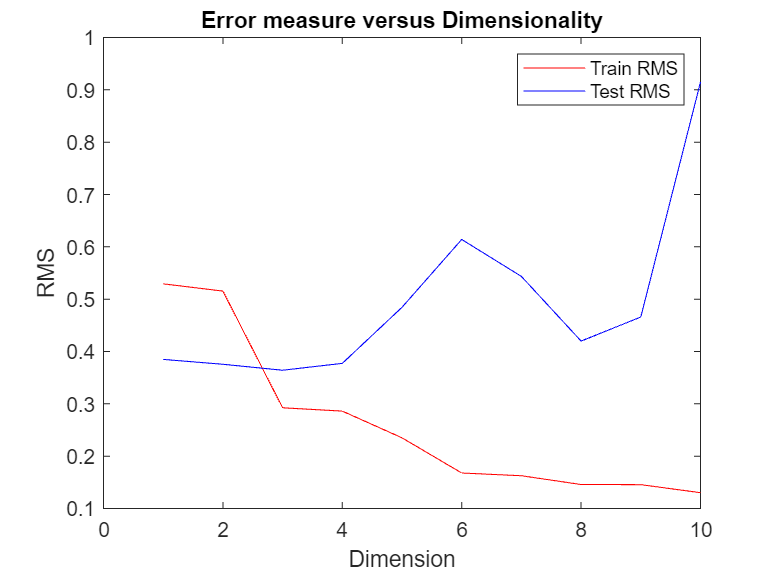

# Polynomial Curve Fitting
 This is a simple regression problem, very useful to understand key concepts of machine learning.
 
 
 The data for this example is generated from the script _creating.data.m_, which is using the sin function with a random noise and creating 20 samples uniformly spaced in range [0, 1].

 After to create the dataset, it is separated into training and testing set. Here, training set comprises 80% of the dataset.

 We shall fit the data using a polynomial function of the form

 $$y(x, \textbf{w}) = w_0 + w_1x + w_2x^2 + \cdots + w_Dx^D = \sum_{j=0}^D w_jx^j$$

 where $D$ is the polynom dimension, x is a sample from dataset, $\textbf{w}$ is a weight vector with dimension $D$ and $y$ is the predicted value.

 With the data created from the script _creating.data.m_, you can use the function _polynomial\_fit.m_ for create a weight vector and fit a polynomial curve.

 Here we have a fit for $D = 3$. This graph is given by the script _polynomial\_fit\_plot.m_ (where you can choose the dimension value).

Error measures correspond to the sum of the squares of the vertical distance between the predicted curve and the sample used to train the model. The goal training the model is to minimize some error measure.

If we have a good model, we also must have a small error measure given by the test set. In this case, once we increase the dimension, the error related to the training set decreases, however, the error related to the test set gets worse. This is known as _overfitting_.

The following figure is given by the script _RMS\_comparing.m_.

